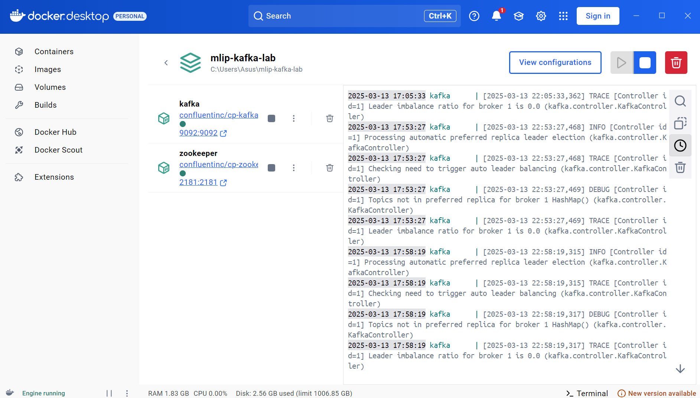
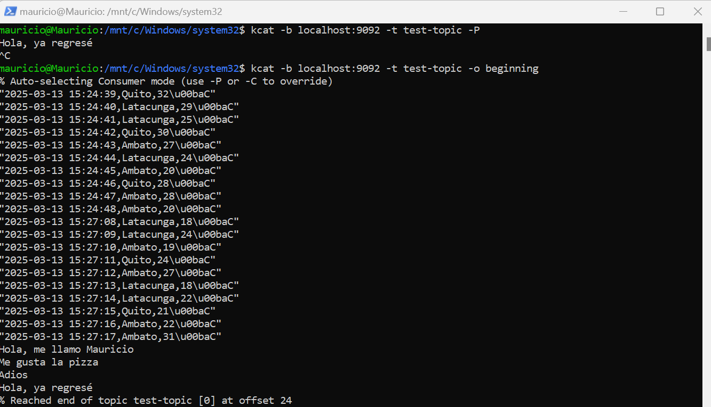

# Lab 2: Kafka for Data Streaming

## Deliverables
- [ ] Modify starter code to implement producer and consumer modes for a Kafka topic.
- [ ] Demonstrate using Kafka's CLI tool *kcat* (or alternatives) to manage and monitor Kafka topics and messages.

**Note: The starter code was edited and executed correctly, and is available in KafkaDemo.ipynb. The "consumed messages" shown in the screenshot were "produced" in the script**

